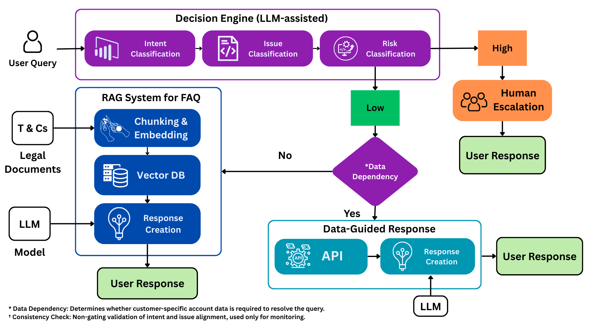
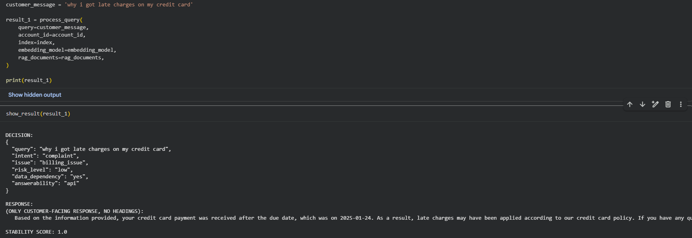
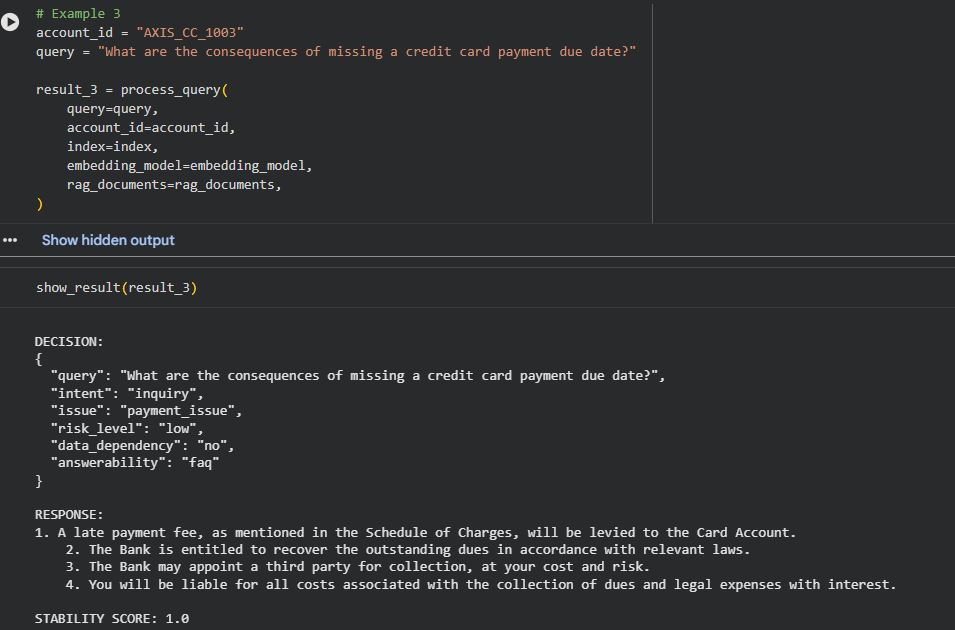
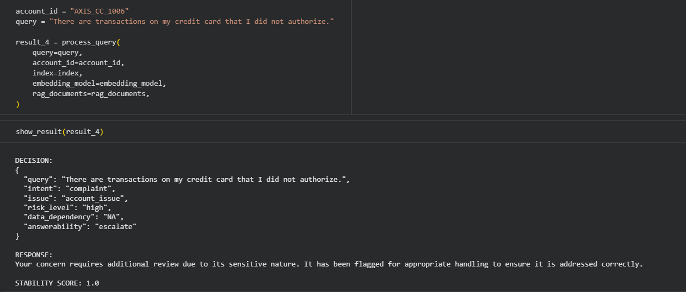

# Agentic Customer Support AI




## Architecture Overview
This system implements a **multi-stage, agentic customer support architecture** designed to safely automate low-risk customer queries while ensuring that high-risk queries are handled by human experts.

At a high level, the architecture follows a **decision-first approach**: instead of immediately generating responses, the system first reasons about *what kind of problem the customer is facing* and *how it should be resolved*.

---
### End-to-End Flow
#### Customer Query Ingestion
Every customer interaction enters the system as a raw natural language query. No assumptions are made upfront about intent, risk, or resolution path.

---

#### Decision Engine (LLM-assisted)
The query is processed by a decision engine that performs multiple lightweight reasoning steps:

- **Intent Classification** – identifies the nature of the request (e.g., inquiry, complaint).
- **Issue Classification** – categorizes the domain of the problem (billing, payment, account, etc.).
- **Risk Detection (Binary)** – determines whether the query represents a **high-risk** scenario (fraud, unauthorized activity, legal escalation, account security) or **low-risk**.

This stage is **LLM-assisted but deterministic in behavior**, ensuring predictable routing rather than free-form generation.

---

#### Human-in-the-Loop Escalation (High Risk)
If the query is classified as **high risk**, it is immediately routed to **Human Escalation**.

This ensures that sensitive, security-critical, or legally relevant cases are never handled autonomously, preserving **trust, safety, and compliance**.

---
#### Data Dependency Decision (Low Risk)
For low-risk queries, the system evaluates **Data Dependency\***:

- If customer-specific account or transaction data is required, the query follows a **data-guided resolution path**.
- If not, it follows a **knowledge-based resolution path**.

---
### Resolution Paths

#### Data-Guided Response
The system retrieves relevant customer data via backend APIs and generates a **structured, context-aware response**.

#### RAG-Based Response
For FAQ and policy questions, the system uses **Retrieval-Augmented Generation (RAG)** over a vector database built from policy and terms documents.

---

#### Response Synthesis & Delivery
The final response is generated using all available context (decision signals, retrieved data, or knowledge snippets) and delivered to the customer in a **consistent, controlled manner**.

---

#### Consistency Check† (Non-Gating)
A non-blocking consistency validation step monitors alignment between intent, issue, and downstream decisions. This is used purely for **observability and continuous improvement** and does not affect routing.

---

### Architectural Benefits

#### Safe Automation
High-risk scenarios are explicitly isolated and escalated to humans, preventing unsafe or non-compliant automated responses.

#### Reduced Human Workload
Low-risk and repetitive queries are resolved automatically, allowing support teams to focus on **complex, high-impact cases**.

#### Deterministic Decisioning
Binary risk detection and explicit data dependency checks avoid ambiguous routing and reduce system instability.

#### Scalable & Modular Design
Each component (classification, routing, RAG, API integration) is modular, enabling **independent evolution and scaling**.

#### Human-Centered by Design
The architecture treats automation as an **assistant, not a replacement**, keeping humans in control where it matters most.

---

\* **Data Dependency:** Determines whether customer-specific account data is required to resolve the query.  
† **Consistency Check:** Non-gating validation of intent and issue alignment, used only for monitoring.

### Proof of Concept Scope

To demonstrate this architecture in a realistic setting, the current proof of concept
is implemented using **credit card customer support scenarios**.

- The knowledge base (RAG system) is built from **credit card Terms & Conditions documents
  published by Axis Bank**.
- Example customer queries and complaint flows are modeled around common
  **credit card billing, payment, and account-related issues**.
- Backend data-guided responses simulate typical **transaction and account lookups**
  required in real-world credit card support workflows.

The underlying architecture is **domain-agnostic** and can be extended to other
financial products or customer support domains with minimal changes.

## 2. Objective

The objective of this project is to demonstrate a **production-oriented, agentic AI architecture**
that can safely automate low-risk customer support queries while ensuring that high-risk scenarios
are escalated to humans.

By combining **LLM-assisted decisioning**, **binary risk detection**, **data-aware routing**, and
**human-in-the-loop controls**, the system aims to:
- Reduce unnecessary human workload,
- Improve response consistency and customer experience,
- Enable scalable and safe automation for customer support workflows.

## 3. Repository Structure

The repository is organized into modular components, each with a clear responsibility:

- **apis/** – Backend API integrations (billing, payment, Supabase)
- **classifiers/** – Intent, issue, risk, and data dependency classifiers
- **pipeline/** – Core decision engine, routing logic, and orchestration
- **rag/** – Retrieval logic and context construction for FAQ resolution
- **vector_db/** – FAISS-based vector database creation and loading
- **generators/** – Final response synthesis modules
- **models/** – LLM and embedding model loaders
- **prompts/** – Modular prompts for classification and generation
- **evaluation/** – Non-gating consistency and stability evaluation
- **T_and_Cs/** – Source policy documents used for the proof of concept
- **notebooks** – Setup and demonstration notebooks (no business logic)

This structure ensures the system remains modular, reproducible, and production-aligned.

## 4. How to Use This Repository

Follow the steps below to run the system locally or on Google Colab.

---

### Option A: Run Locally

#### Step 1: Clone the Repository

```bash
git clone https://github.com/<your-username>/agentic-customer-support-ai.git
cd agentic-customer-support-ai
```
#### Step 2: Install Dependencies
```bash
pip install -r requirements.txt
```
Python 3.9+ is recommended.

#### Step 3: Set Environment Variables
Create a .env file or export environment variables manually:
```bash
HUGGINGFACE_HUB_TOKEN=<your_huggingface_token>
SUPABASE_URL=<your_supabase_project_url>
SUPABASE_KEY=<your_supabase_key>
```

#### Step 4: Create the Vector Database (One-Time Setup)

Run the notebook:
```bash
00. vector_database_creation.ipynb
```
This step:
- Processes credit card Terms & Conditions documents
- Generates embeddings
- Creates the FAISS vector index
- Stores vector artifacts locally

#### Step 5: Run the End-to-End Pipeline
```bash
01 main.ipynb
```
This notebook:
- Loads models and embeddings
- Loads the vector database
- Executes the full decision pipeline
- Demonstrates low-risk, data-dependent, and high-risk escalation flows

### Option B: Run on Google Colab

This project has been tested on Google Colab and runs without modification.

#### Step 1: Upload the Repository

- Download the repository as a ZIP file
- Upload it to Google Colab
- Unzip it inside the Colab environment

```python
!unzip agentic-customer-support-ai.zip
%cd agentic-customer-support-ai
```
#### Step 2: Install Dependencies
```python
!pip install -r requirements.txt
```
#### Step 3: Set Environment Variables
Set environment variables securely in Colab:
```python
import os

os.environ["HUGGINGFACE_HUB_TOKEN"] = "<your_huggingface_token>"
os.environ["SUPABASE_URL"] = "<your_supabase_project_url>"
os.environ["SUPABASE_KEY"] = "<your_supabase_key>"
```
#### Step 4: Run Notebooks in Order

- Run 00. vector_database_creation.ipynb
- Run 01 main.ipynb
- This will execute the complete pipeline end-to-end.

## 5. Sample Outputs

Below are representative examples demonstrating the different resolution paths of the system.

---

### Example 1: API-Based Response (Data-Guided)



In this scenario, the query requires customer-specific account or transaction data.
The system detects data dependency, retrieves relevant information via backend APIs,
and generates a structured, context-aware response.

This demonstrates the **data-guided resolution path** for low-risk,
account-specific issues.

---

### Example 2: FAQ-Based Response (RAG)



In this case, the query is informational and does not require customer-specific data.
The system routes the request to the RAG pipeline, retrieves relevant policy content
from the vector database, and synthesizes a knowledge-based response.

This illustrates the **knowledge-driven resolution path** for general inquiries.

---

### Example 3: High-Risk Escalation (Human-in-the-Loop)



Here, the system detects a high-risk scenario (e.g., fraud or unauthorized activity).
Instead of generating an automated response, the query is escalated to human support.

This ensures **safe handling of sensitive cases**, preserving compliance,
security, and customer trust.

## 6. Future Enhancements

The current implementation represents a strong **v1 architecture**. The system is intentionally designed to evolve. Some potential future enhancements include:

---

### Multi-Model Execution Strategy

Currently, a single LLM is used across decisioning and response generation.
This can be extended to a **multi-model architecture**, where:

- Lightweight or smaller models are used for:
  - Intent classification
  - Issue classification
  - Risk detection
- Larger or more capable models are reserved for:
  - Response synthesis
  - Complex, context-rich explanations

This separation can significantly reduce latency and cost while maintaining
high-quality responses.

---

### Multi-Source RAG Support

The RAG pipeline can be extended to support **multiple knowledge sources**, such as:
- Product-specific documentation
- Regulatory guidelines
- FAQs across different financial products

By introducing document-level routing or source-aware retrieval, the system
can dynamically retrieve and reason over the most relevant knowledge base
before generating a response.

---

### Learning from Historical Interactions

Future versions can incorporate:
- Historical support tickets
- Escalation outcomes
- Resolution feedback

This would enable continuous improvement in:
- Risk detection accuracy
- Data dependency decisions
- Escalation precision

---

### Observability and Metrics

Introduce monitoring for:
- Escalation rates
- False positives in risk detection
- Resolution accuracy
- End-to-end latency

These metrics can guide iterative improvements and support production deployment.

---

## 7. Conclusion

- This project demonstrates a **production-oriented, agentic customer support architecture for the BFSI (Banking, Financial Services, and Insurance) domain**, implemented as a proof of concept using credit card support workflows.

- By combining **LLM-assisted decisioning**, **binary risk detection**, **data-guided resolution**, and **human-in-the-loop escalation**, the system safely automates low-risk queries while ensuring sensitive cases are handled by human agents.

- When applied in a real banking environment, such an architecture can **improve customer experience** and **significantly reduce human workload** by automating repetitive and low-risk interactions. With further iterations (v2 and beyond)—including multi-model execution, richer retrieval, and learning from historical interactions—these efficiency gains can continue to increase over time.

- Although the current proof of concept is focused on banking and credit cards, the architecture is **domain-agnostic** and can be extended to other industries such as retail, e-commerce, telecom, insurance, and SaaS customer support.

### 👤 Author

**Veer Khot**  
LinkedIn: https://www.linkedin.com/in/veer-khot-93177bab/